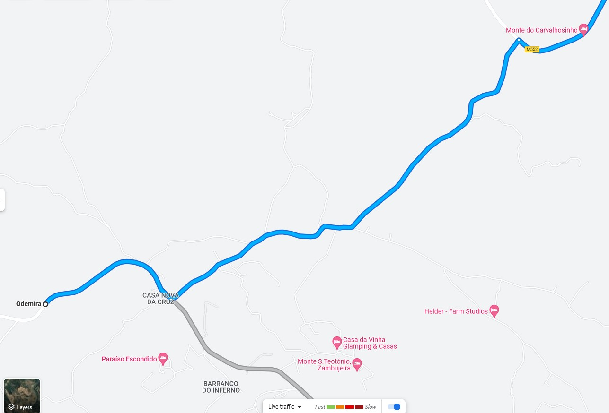

# Tesla Improvement Backlog

A repository containing a checklist of issues and features that would improve Product Quality and User Experience.
Units mentioned in this document will follow the International System of Units and dates will be presented in the **yyyy/mm/dd** format.

## Backlog

- [ ] Restore USB playback after sleep state if USB was the selected audio source before sleeping.
- [ ] Perform audio search on USB besides Spotify. If Premium is not enabled and USB contains music, search should focus primarily on USB.
- [ ] When playing from USB, touching the music card should select the current track on the respective folder of the USB device.
- [ ] Implement gapless playback for USB audio [[1]](#note-1).
- [ ] Make speed-sensitive volume a configurable option again, or turn it off by default.
- [ ] Some vehicles don't have the option to select the temperature for activating Cabin Overheat Protection [[2]](#note-2).
- [ ] Navigation should zoom-in in places with lots of intersections and if the suggested path requires a turn on any of those intersections. Zoom level (or map scale) should be enough to make every intersection distinguishable on the screen. What is "a lot of intersections"? Let's assume any 10 meter stretch of road with more than one intersection [[3]](#note-3).
- [ ] Multi-language recognition on voice commands [[4]](#note-4).
- [ ] Reduce phantom braking in particular cases [[5]](#note-5).
- [ ] Fix wipers turning on for no apparent reason. Seems to be caused by sunlight coming through tree foliage and hitting the windscreen.
- [ ] Make Enhanced Autopilot and Full Self-Driving available as subscriptions in Europe.
- [ ] Support for voice commands should be equal on all supported languages [[6]](#note-6).
- [ ] Switch off the interior lights (both dome and ambient lights) if the car is locked, no one is sitting on the inside and dog/camp mode is inactive.
- [X] Add fold/unfold mirrors to the shortcut list of the left scroll wheel. **Added on 2024.38.25**
- [ ] Fix navigation ignoring certain roads [[7]](#note-7).
- [X] Allow turning off the wipers when on Autopilot [[8]](#note-8). **Solved on 2023.44.25**
- [ ] Add option to turn off wireless phone charging.
- [ ] Allow turning off air flow for the passenger side alone, on Model 3/Y prior to Highland.
- [ ] Copy full itinerary to vehicle from phone App like Google Maps, instead of just the destination point.
- [X] Dead reckoning not re-enabling after prolonged deep sleep [[9]](#note-9). **Issue can be fixed remotely by Service Center**
- [ ] Add the estimated finish date/time for charging on the App, besides the remaining time [[10]](#note-10).
- [ ] Restore the minimum parking distance of 30 cm for the Model 3 with back ultrasonic sensors (USS). This was set to 40 cm after update 2024.14.6.
- [X] Solve Tesla App rendering issues introduced since early April release: https://www.youtube.com/shorts/RHsV7483uVQ. **This seemed to be related with iOS and was solved with iOS 18 upgrade**
- [ ] Remove the "Bluetooth on" requirement on Android to see saved sentry videos.
- [ ] Make calendar scroll faster on Intel processors.
- [ ] Keep option on climate controls should keep the current settings, not change it to auto.

# Notes

## Note 1
Not having gapless playback is like being dragged out of the zone everytime playback moves to the next track on the album.

## Note 2
Difference in software feature support. If these are caused by hardware changes then it should be made clear for owners through the manual or some other official documentation.

## Note 3
Here is an example of a main road (R. Direita) traversing a small village. Notice the 3 interceptions in just 10.62 meters stretch of the main road. In Europe, some roads were built by Romans who traveled using horses more than 2000 years ago. Roads that narrow are usually tightly packed in some areas.

## Note 4
Imagine having the infotainment set to Portuguese and then using the voice command "Ligar para Elon Musk", which means "Call Elon Musk", and instead of the desired outcome, the command "Ligar / Call" is recognized but the name is not, resulting in gibberish.
Conversely, assuming the infotainment is set to English and the vehicle is traveling in Portugal, when the voice command "Navigate to Ericeira" is issued, a similar gibberish result will happen.

This also happens with Google Maps, by the way!

- Interpretation failing (Ligar para Elon Musk): https://youtube.com/shorts/TKKCOxPPl0A
- Interpretation failing (Navigate to Ericeira): https://youtube.com/shorts/3dkkxvKyq8I
- Working correcly (Navegar para Ericeira): https://www.youtube.com/shorts/4RrTzKC0dNc

## Note 5
Phantom braking seems to be related to quickly passing from a bright area to a dark area. This is always the case with in this place: https://goo.gl/maps/UntGW1vgpS67g95L9 (Google Street View), https://goo.gl/maps/YtuBvAwzYKCu4791A (Pin / Placemark), or simply the coordinates 38.75756188349858, -9.171885145989462.

 Notice the reflective signs on the side of the bridge slightly facing downwards to the vehicles. Soon after, a very dark shadow cast by the bridge.

## Note 6
There are missing commands in Portuguese when compared with the available commands in English. For example, unfolding mirrors (abrir espelhos) is not supported, but folding mirrors (fechar espelhos) is supported.
Another example: all the voice commands for showing a settings page, e.g. lights, locks, display, won't work in Portuguese.

## Note 7
Some roads on the map coverage are completly ignored by navigation. There is no clear pattern on why some roads are ignored, but I leave a couple of images below as an example for this specific road: https://goo.gl/maps/iC1AYiaTJsKaaXvu8.

*Already on the ignored road and navigation suggests turning back. This is an asphalt road*

*More detailed location for Google Maps comparison*

*Road is considered by Google Maps navigation*

 ## Note 8
 When the windshield is dirty (specially with bugs), activating the Autopilot also activates the wipers on full speed. This behaviour does not contribute to safety and damages the wiper blades. Previous software versions allowed turning off the wipers with the Autopilot on. Also, this behaviour is inconsistent with auto high-beams, which can be turned off after being activated by Autopilot.

 ## Note 9
The image below shows a [TeslaMate](https://github.com/adriankumpf/teslamate) drive log with an erroneous position capture after the car left a garage sitting below ground level (hence no GNSS signals). This issue started happening at 2023/08/09.

 ## Note 10
 Include on the Tesla App the estimated date/time for end-of-charge, similar to TeslaMate.
 Suggestion: touching the label with the remaining time, should alternate between remaining time and expected end-of-charge date/time.

 
